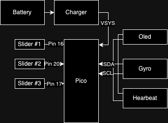

# Pure Watch
Pure Watch is an open-source and open-hardware "smart" watch.

## Hardware
- Raspberry Pi Pico W
- MPU6050 Gyro Sensor
- SSD1306 128x32 Oled Display
- MAX30102 Heartbeat Sensor
- 3.7V 250mAh Li-Po Battery
- TP4056 Type-C Charger
- 3 Slider Switches

### Hardware Diagram
Here is a super simple diagram to explain connections:

## Plan
- [ ] Time sync with local file, wifi and cable connection
- [ ] Close display if there is no movement
- [ ] Show display if there is movement
- [ ] Read heartbeat and display it
- [ ] Bluetooth
- [ ] "T-Rex Chrome Dino Game" like game using gyro (can be fun)
- [ ] Sleep improvements for battery life
- [ ] Convert to C instead of micropython?
- [ ] Super simple mobile app to configure ssid, password and etc.. via bluetooth
